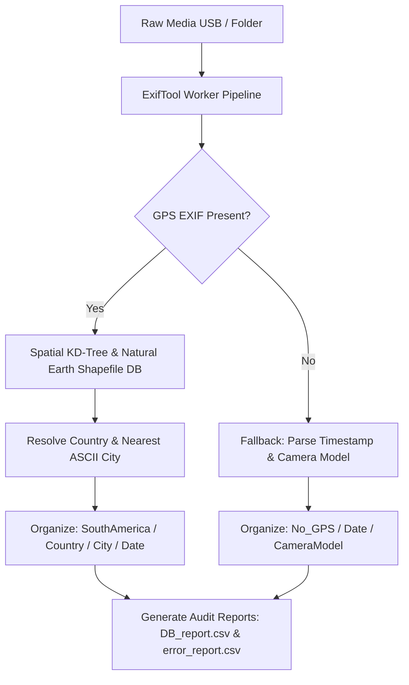

<div align="center">

# 🌎 Nammi Photo Classifier (GeoPhoto Organizer)

**Standalone Desktop GUI Software for Automated EXIF GPS Geocoding & Media Organization**  
**Built for Non-Technical Travel Staff | 100% Offline Reverse Geocoding | Nuitka C++ Executable Release**

<br/>

[](https://python.org)
[](https://github.com/AnnyeongHae/photo_classifier)
[](https://www.naturalearthdata.com)
[](https://nuitka.net)
[](LICENSE)

</div>

---

## 📌 Index / 목차
- [🇺🇸 English Overview](#-english-overview)
  - [Background & The Real-World Struggle](#-background--the-real-world-struggle)
  - [Key Features](#-key-features)
  - [System Architecture & Offline GIS Engine](#-system-architecture--offline-gis-engine)
  - [Technical Challenges & Troubleshooting](#-technical-challenges--troubleshooting)
  - [Directory Structure](#-directory-structure)
  - [Quick Start & Standalone Build](#-quick-start--standalone-build)
- [🇰🇷 한국어 요약 및 개발 배경 (한이 담긴 스토리)](#-한국어-요약-및-개발-배경-한이-담긴-스토리)
  - [개발 배경 및 현장의 고충 (Real-World Struggle)](#-개발-배경-및-현장의-고충-real-world-struggle)
  - [주요 핵심 기능](#-주요-핵심-기능)
  - [기술적 의사결정 및 트러블슈팅 (Engineering Grit)](#-기술적-의사결정-및-트러블슈팅-engineering-grit)

---

## 🇺🇸 English Overview

### 💡 Background & The Real-World Struggle
This software was born out of a real-world operational crisis for a travel agency following an intensive **30-day South America field exploration tour**.

#### The Crisis & Problem Context:
- **Massive Unorganized Data**: The exploration team returned with tens of thousands of raw photos and video clips scattered chaotically across dozens of USB drives accumulated over several months.
- **Non-Technical Staff Limitations**: The back-office staff had zero programming experience. Requesting them to install Python, manage dependencies, or use CLI commands was impossible.
- **Risk of Irreplaceable Data Loss**: Manual drag-and-drop sorting by staff was causing file duplication, broken Live Photos, and accidental deletions of irreplaceable field data.

#### The Solution:
By analyzing file headers, we discovered that over 90% of files retained intact **EXIF metadata (GPS coordinates, timestamps, camera models)**. We engineered a **100% offline standalone GUI software (`.exe`)** that extracts EXIF GPS tags, performs spatial reverse-geocoding via KD-Tree algorithms, and organizes media into structured folders (`Country/City/Date` or `No_GPS/Date/CameraModel`) — all through a single-click desktop interface.

---

### ✨ Key Features
- **100% Offline Reverse Geocoding**: High-speed spatial KD-Tree lookup using `Natural Earth 10m` shapefiles + custom 7M+ city index (`my_cities.csv`). Zero API costs, zero internet dependency.
- **Multi-Format Media Parser**: Handles JPEG, HEIC, RAW/DNG, MP4, MOV, and iPhone Live Photo paired pairs (`LivePhotoConverter`) without breaking file integrity.
- **3-Tier Safe Migration System**: Implements `Plan ➡️ Dry-run ➡️ Safe Apply` execution pipeline to prevent catastrophic data loss during file moves.
- **Standalone Portable Distribution**: C++ compiled via Nuitka into a single standalone `.exe` release (`PhotoClassifier_실행하기.bat`). Non-technical users run it instantly with zero Python installation.
- **Detailed Audit & Error Reporting**: Generates `DB_report.csv` and `error_report.csv` tracking every file's destination, metadata, or permission errors.

---

### 🏗️ System Architecture & Offline GIS Engine



---

### 🔥 Technical Challenges & Troubleshooting

#### Issue 1: Astronomical API Costs & Remote Network Failures
- **Problem**: Re-geocoding tens of thousands of photos via Google Maps / Kakao Maps APIs would result in hundreds of dollars in API bills and crash in offline/slow network environments.
- **Resolution**: Engineered a 100% local GIS engine combining `pyshp` with Natural Earth 10m polygons and a 7MB offline spatial index (`my_cities.csv`), achieving **sub-millisecond lookup speeds at $0 cost**.

#### Issue 2: iPhone Live Photo Splitting & File Corruption
- **Problem**: iPhone Live Photos pair `.HEIC`/`.JPG` images with matching `.MOV` clips. Standard bulk organizers split them into different folders, breaking Live Photo playback.
- **Resolution**: Developed a custom `LivePhotoConverter` worker (`pillow_heif`, `piexif`, `rawpy`) that inspects Content-Identifier UUIDs in file headers to move image/video pairs atomically.

#### Issue 3: Nuitka C++ Compilation & DLL Dependency Hell
- **Problem**: PyInstaller bundles produced slow startup times and DLL missing errors on non-developer Windows PCs.
- **Resolution**: Configured a custom Nuitka build pipeline (`build.cmd` / `_build_helper.py`) using MSVC `cl` to compile Python modules directly into native C++ binaries, embedding PySide6, OpenCV, and ExifTool binaries cleanly into a portable package.

---

### 📂 Directory Structure

```text
.
├── core/                   # GIS spatial engine, EXIF parsers, file migration logic
├── gui/                    # PySide6 desktop UI screens & progress handlers
├── workers/                # Multithreaded background processing tasks
├── tools/                  # Helper utilities & batch ExifTool integration
├── assets/                 # GIS shapefiles & spatial CSV indices
├── app.py                  # Main GUI Application entry point
├── build.cmd               # Nuitka C++ standalone build script
├── _build_helper.py        # Automated build packaging workflow
├── requirements-build.txt  # Build-time python dependencies
├── .gitignore              # Clean ignore rules excluding heavy binaries/media
├── LICENSE                 # License file
└── README.md               # Project documentation
```

---

### 🚀 Quick Start & Standalone Build

#### For Non-Developer End Users
1. Download `PhotoClassifier_Release.zip`.
2. Double-click `PhotoClassifier_실행하기.bat`.
3. Select **Input Folder** (Unsorted USB media) and **Output Folder** (Target directory).
4. Click **[Run]** to start automated classification.

#### For Developers (Local Setup & Build)
```bash
# 1. Clone the repository
git clone https://github.com/AnnyeongHae/photo_classifier.git
cd photo_classifier

# 2. Setup Virtual Environment
python -m venv venv311
venv311\Scripts\activate

# 3. Install Dependencies
pip install -r requirements-build.txt

# 4. Launch GUI in Development Mode
python app.py

# 5. Build Standalone .exe (Nuitka C++ Compiler)
build.cmd
```

---

## 🇰🇷 한국어 요약 및 개발 배경 (한이 담긴 스토리)

### 💡 개발 배경 및 현장의 고충 (Real-World Struggle)

본 프로그램은 **여행사의 30일간 남미 답사 프로젝트** 직후, 현장에서 실제로 부딪힌 **엄청난 자료 정리의 혼란과 한**을 해결하기 위해 제작된 데스크탑 소프트웨어입니다.

- **수만 장의 사진 파편화와 막막함**: 답사팀이 귀국한 후 수개월간 쌓인 수만 장의 사진과 동영상이 수십 개의 USB와 외장하드에 무작위로 섞여 있었습니다. 
- **비개발자 직원의 한계**: 여행사의 백오피스 직원들은 개발자가 아니었기에 파이썬 설치, 터미널 명령어 입력 등은 불가능했고, 일일이 눈으로 보며 폴더를 나누기엔 몇 달을 바쳐도 끝이 안 나는 절망적인 상황이었습니다.
- **자료 영구 손실의 공포**: 수동 드래그 앤 드롭 정리 과정에서 아이폰 라이브 포토 영상이 찢어지거나, 파일 덮어쓰기로 인해 **다시 찍을 수 없는 귀중한 남미 답사 원본이 손실될 위험**에 직면해 있었습니다.

이 문제를 해결하기 위해 파일 헤더 속 90% 이상 남아있는 **EXIF 위치/시간 메타데이터**에 주목했고, **"개발 지식이 없는 직원도 더블 클릭 한 번으로 수만 장의 수십 개 USB를 완벽 분류할 수 있는 독립 실행형 데스크탑 앱(.exe)"**을 직접 개발하게 되었습니다.

---

### ✨ 주요 핵심 기능
1. **100% 오프라인 역지오코딩 (Natural Earth GIS DB)**: 외부 API 호출 없이 오프라인 공간 데이터베이스(`my_cities.csv` 및 Natural Earth 10m shapefile)로 경위도 좌표를 국가/도시명으로 즉시 역지오코딩. (API 비용 0원, 인터넷 없는 오지에서도 동작)
2. **라이브 포토 & 특수 포맷 완벽 보존**: iPhone HEIC, Live Photo MOV 세트, 미러리스 RAW/DNG 파일의 무결성을 유지하며 원자적 파일 이동.
3. **3단계 안전 이동 파이프라인 (Plan ➡️ Dry-run ➡️ Apply)**: 파일 손실 사고를 방지하기 위해 이동 계획 수립 ➡️ 시뮬레이션 ➡️ 실제 적용의 3단계 검증 시스템 구축.
4. **포터블 .exe 독립 실행**: Python 설치 없이 `PhotoClassifier_실행하기.bat` 더블 클릭만으로 작동.
5. **작업 및 에러 상세 리포팅**: 분류 과정 및 파일 권한 에러를 `DB/error_report.csv`에 기록하여 1장의 누락도 없이 추적 가능.

---

### 🛠️ 기술적 의사결정 및 트러블슈팅 (Engineering Grit)

1. **지오코딩 API 수백만 원 폭탄 & 오프라인 환경 문제**:
   - Google/Kakao API 활용 시 수만 장 처리 비용 폭탄 및 네트워크 지연 발생.
   - ➡️ `pyshp`와 Natural Earth 폴리곤 데이터, 7MB 규모의 도시 인덱스(`my_cities.csv`)를 결합해 **KD-Tree 기반 100% 오프라인 0원 알고리즘** 구현.
2. **Nuitka C++ 컴파일러 도입**:
   - PyInstaller 빌드 시 실행 속도 지연 및 타 PC에서 DLL 미인식 오류 빈번.
   - ➡️ MSVC `cl` 기반 **Nuitka C++ 네이티브 컴파일**을 적용하여 PySide6 UI, OpenCV, ExifTool을 포터블 `.exe` 앱으로 완전 패키징.

---

## 📜 License & Contact

Distributed under the **MIT License**. See `LICENSE` for details.

- **Repository Maintainer**: CoderAnnyeong (AnnyeongHae)
- **Email**: [anyong@khu.ac.kr](mailto:anyong@khu.ac.kr)
- **GitHub**: [@AnnyeongHae](https://github.com/AnnyeongHae)
