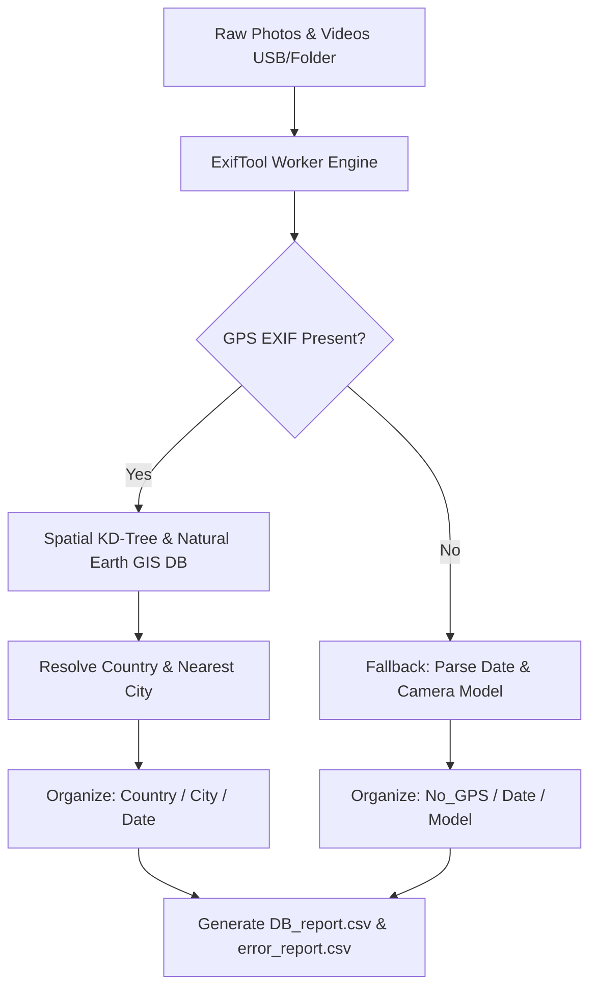

<div align="center">

# 🌎 Nammi Photo Classifier (GeoPhoto Organizer)

**Standalone Desktop GUI Software for Automated EXIF GPS Geocoding & Media Organization**  
**Built for Non-Technical Users | 100% Offline Reverse Geocoding | Nuitka Executable Release**

<br/>

[](https://python.org)
[](https://github.com/AnnyeongHae/photo_classifier)
[](https://www.naturalearthdata.com)
[](LICENSE)

</div>

---

## 📌 Index / 목차
- [🇺🇸 English Overview](#-english-overview)
  - [Background & Real-World Story](#-background--real-world-story)
  - [Key Features](#-key-features)
  - [Output Folder Structure](#-output-folder-structure)
  - [Technical Architecture & Offline Geocoding](#-technical-architecture--offline-geocoding)
  - [Standalone Build & Quick Start](#-standalone-build--quick-start)
- [🇰🇷 한국어 요약 및개발 배경](#-한국어-요약-및-개발-배경)
  - [개발 스토리](#-개발-스토리)
  - [주요 핵심 기능](#-주요-핵심-기능)
  - [분류 규칙](#-분류-규칙)

---

## 🇺🇸 English Overview

### 📖 Background & Real-World Story
This software was commissioned by a travel agency following an extensive **30-day South America field exploration tour**. 

Upon returning, the travel team faced thousands of unorganized photos and video clips scattered across dozens of USB drives over several months. Manual sorting was practically impossible for non-technical agency staff.

Upon analyzing the media files, we discovered intact **EXIF metadata (GPS coordinates, timestamps, camera models)** in 90%+ of the files. To solve this problem:
1. We developed an **offline spatial reverse-geocoding engine** using Natural Earth shapefiles and custom city databases.
2. We packaged the tool as a **standalone Windows `.exe` GUI Application**, enabling non-developer staff to run the organization pipeline on any PC with zero installation or terminal configuration required.

---

### ✨ Key Features
- **100% Offline Reverse Geocoding**: High-speed spatial KD-Tree lookup using `Natural Earth 10m` shapefiles + custom 7M+ city database (`my_cities.csv`). Zero API costs, 100% offline data privacy.
- **EXIF Metadata Engine**: Extracts GPS lat/lon, creation timestamp, camera make/model, and video metadata via integrated ExifTool worker pipelines.
- **Smart Directory Hierarchy Rules**:
  - `GPS-enabled media`: Classified into `SouthAmerica / Country / City / YYYY.MM.DD`
  - `No-GPS media (e.g. KakaoTalk/Social downloads)`: Classified into `No_GPS / YYYY.MM.DD / CameraModel`
- **Standalone Portable Distribution**: Bundled into a native Windows `.exe` release via Nuitka compilation. Users simply double-click `PhotoClassifier_실행하기.bat`.
- **Full Processing Audit Reports**: Automatically generates `DB_report.csv` and `error_report.csv` inside the `DB/` folder for tracking unparseable files or file permission errors.

---

### 📂 Output Folder Structure

```text
Output_Folder/
├── SouthAmerica/
│   ├── Argentina/
│   │   └── Buenos_Aires/
│   │       └── 2026.04.10/
│   │           ├── IMG_0001.JPG
│   │           └── VID_0002.MP4
│   └── Peru/
│       └── Cusco/
│           └── 2026.04.15/
│               └── IMG_0050.JPG
└── No_GPS/
    └── 2026.04.11/
        └── Apple_iPhone 14 Pro/
            └── KAKAO_PHOTO.jpg
```

---

### 🏗️ Technical Architecture & Offline Geocoding



---

### 🚀 Standalone Build & Quick Start

#### For Non-Developer End Users (Executable Mode)
1. Unzip `PhotoClassifier_Release.zip`.
2. Double-click `PhotoClassifier_실행하기.bat`.
3. Select **Input Folder** (Unsorted photos) and **Output Folder** (Target destination).
4. Click **[Run]** to initiate automated categorization.

#### For Developers & Custom Builds
```bash
# 1. Clone the repository
git clone https://github.com/AnnyeongHae/photo_classifier.git
cd photo_classifier

# 2. Create virtual environment & install requirements
python -m venv venv311
venv311\Scripts\activate
pip install -r requirements-build.txt

# 3. Run GUI in development mode
python app.py

# 4. Build Standalone .exe with Nuitka
build.cmd
```

---

## 🇰🇷 한국어 요약 및 개발 배경

### 💡 개발 스토리 (Real-World Problem Solving)
본 프로그램은 **여행사의 30일간 남미 답사 프로젝트** 이후 백오피스 직원들의 사진/영상 정리 문제를 해결하기 위해 개발된 데스크탑 응용 소프트웨어입니다.

- **문제 상황**: 답사팀이 귀국한 후 수개월간 쌓인 수천 장의 사진과 영상이 수많은 USB에 무작위로 흩어져 있었고, 개발 지식이 없는 직원들이 일일이 장소와 날짜별로 분류하는 것이 불가능했습니다.
- **해결 방안**: 사진/영상 파일의 90% 이상에 **EXIF GPS 위치 정보**가 보존되어 있음을 파악하고, 이를 기반으로 **국가/도시/날짜/카메라 모델별로 자동 분류해 주는 GUI 소프트웨어**를 제작했습니다.
- **소프트웨어(Standalone Software) 형태 배포**: 개발 환경(Python, 패키지 설치)이 없는 일반 사용자 PC에서도 클릭 한 번으로 실행할 수 있도록 Nuitka를 활용해 독립 실행형 `.exe` 포터블 프로그램으로 패키징하여 제공했습니다.

### ✨ 주요 핵심 기능
1. **100% 오프라인 위치 인덱싱 (Natural Earth GIS DB)**: 외부 API 호출 없이 오프라인 공간 데이터베이스(`my_cities.csv` 및 Natural Earth 10m shapefiles)로 경위도 좌표를 국가/도시명으로 즉시 역지오코딩. (비용 0원, 보안 유지)
2. **스마트 예외 처리 (No-GPS 분기)**: 위치 정보가 없는 메신저(카카오톡) 전송 사진이나 기본 영상은 `No_GPS / 촬영일자 / 카메라모델` 폴더로 분기 저장.
3. **작업 리포트 생성**: 처리 과정 중 권한 에러나 훼손된 파일이 있을 경우 `DB/error_report.csv`에 명확히 기록하여 파일 누락 방지.

---

## 📜 License & Contact

Distributed under the **MIT License**. See `LICENSE` for details.

- **Repository Maintainer**: CoderAnnyeong (AnnyeongHae)
- **Email**: [anyong@khu.ac.kr](mailto:anyong@khu.ac.kr)
- **GitHub**: [@AnnyeongHae](https://github.com/AnnyeongHae)
